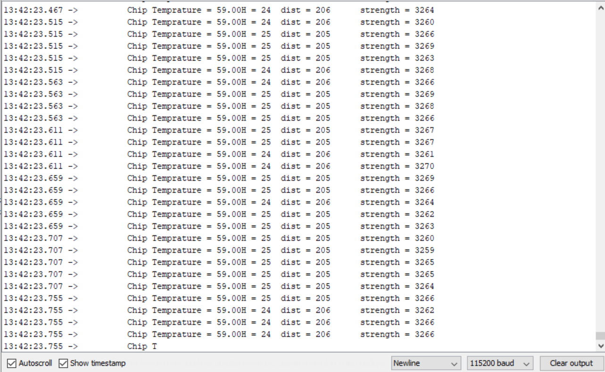
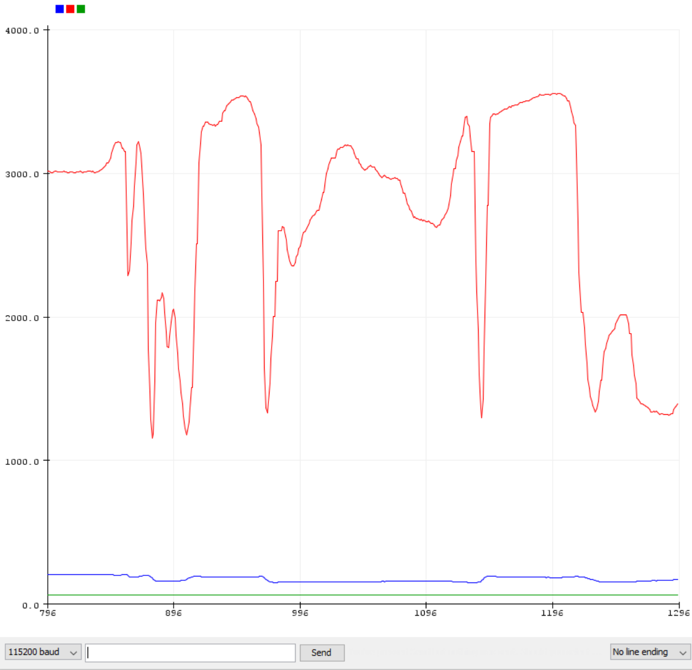
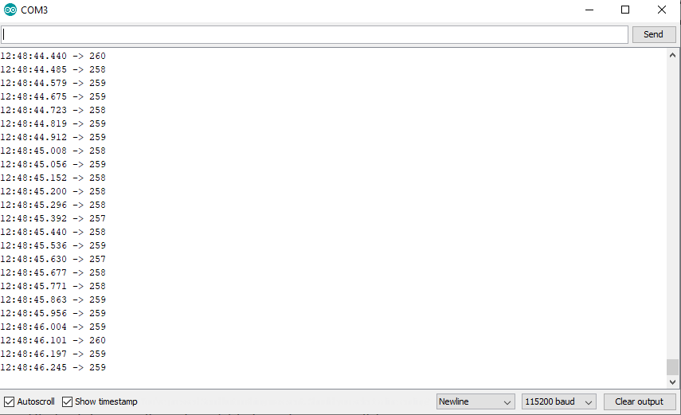
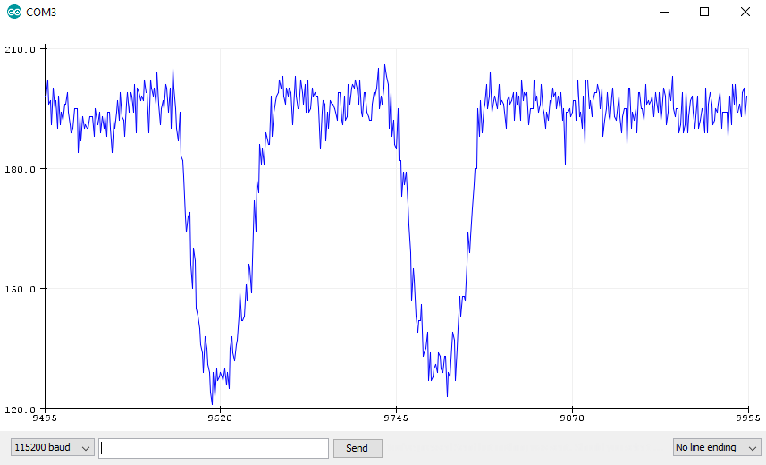
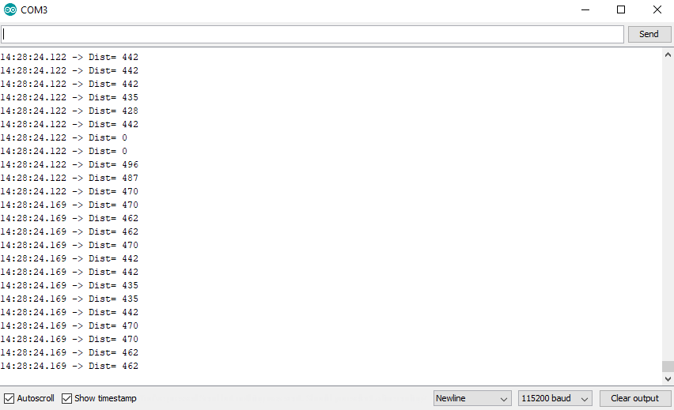
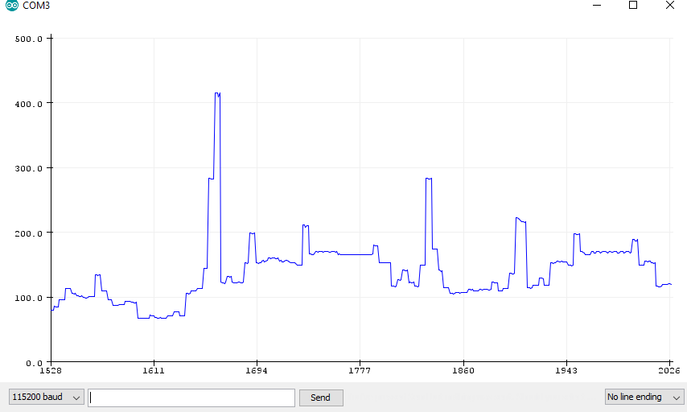

# Tutorial for Laser Distance Sensors

This repository contains source code and circuit illustration for 3 laser distance sensors.

* [TFMini Plus](#tfmini)
* [Garmin LIDAR Lite v4](#garmin)
* [Sharp GP2Y0A710](#sharp)

## TFMini Plus 

TFMini Plus - Micro LiDAR Module can be found on [Sparkfun](https://www.sparkfun.com/products/15179) ($44.95). Official documentation from Benewake is [here](http://en.benewake.com/product/detail/5c345cd0e5b3a844c472329b.html).

* Range: 0.1-12m
* Accuracy: +/-5cm @ 0.1-6m, +/-1% @ 6-12m,
* Distance resolution: 4cm (Measurement fluctuation of "steady state" is less than +/-2cm)

### Wires -> Arduino

TFMini Plus should come with a breakout connection cable. The connector is a 4pin picoblade 1.25mm connector. This is NOT the same as a 4pin JST connector, typically found to drive PWM-capable computer fans. Description of this connector can be found on [Molex website](https://www.molex.com/molex/products/part-detail/cable_assemblies/0151340400). 
 (also found in Lenovo Y500 laptop for cooling fan, see AliExpress listing for the cooling assembly [here](https://www.aliexpress.com/item/32806425537.html)).

TFMini Plus uses UART communication protocol.

* Green -> Arduino Uno Pin 2 (see [source code](tf_mini_plus/tf_mini_plus.ino))
* White -> Arduino Uno Pin 3 (see [source code](tf_mini_plus/tf_mini_plus.ino))
* Red -> Arduino 5V
* Black -> Arduino Black

;

### Source Code and Outputs 

Source code is adapted from Benewake [documentation](http://en.benewake.com/product/detail/5c345cd0e5b3a844c472329b.html).

;

;

## Garmin LIDAR-Lite v4 LED  

Garmin LIDAR-Lite v4 LED can be found on [Sparkfun](https://www.sparkfun.com/products/15776) ($59.99/$61.95 (with QWIIC)). This guide is for the version with Sparkfun's QWIIC connector sold on [this page](https://www.sparkfun.com/products/15777). Official documentation for LIDAR-Lite v4 is [here](https://static.garmin.com/pumac/LIDAR-Lite%20LED%20v4%20Instructions_EN-US.pdf). 

* Range: 5cm - 10m
* Accuracy: +/-1cm @2m, +/-2cm @4m, +/-5cm@10m
* Distance resolution: 4cm (Measurement fluctuation of "steady state" is less than +/-2cm)

### Wires -> Arduino (QWIIC breakout extends useful pins for I2C communication)

Garmin LIDAR-Lite v4 comes with a short extension for 10 pins. Usage for these 10 pins can be found in the [official documentation](https://static.garmin.com/pumac/LIDAR-Lite%20LED%20v4%20Instructions_EN-US.pdf). Sparkfun's QWIIC breakout simply taps into the 4 pins needed for I2C communication. Its QWIIC breakout board is useful if you do not have small pins (extension on the Lidar uses small pin holes).

TFMini Plus uses I2C communication protocol.
* SDA -> Arduino Uno SDA
* SLK -> Arduino Uno SLK
* 3.3V -> Arduino Uno 3.3V
* GND -> Arduino Uno GND

;

### Source Code and Outputs

Source code is adapted from Garmin [Github](https://github.com/garmin/LIDARLite_Arduino_Library/tree/master/examples/v4LED). The included file copies from [v4LED_fast.ino](https://github.com/garmin/LIDARLite_Arduino_Library/blob/master/examples/v4LED/v4LED_fast/v4LED_fast.ino), but `myLidarLite` is initialized using configuation `5` (high accuracy, low error mode).

;

;

## Sharp GP2Y0A710K0F   

Sharp GP2Y0A710K0F can be found on [Adafruit](https://www.adafruit.com/product/1568) ($29.95). Official documentation for this module is [here](https://cdn-shop.adafruit.com/datasheets/gp2y0a710k.pdf).

* Range: 1m-5.5m
* Accuracy: Not officially stated
* Distance resolution: 6cm (Measurement fluctuation of "steady state" is less than +/-3cm)

### Wires -> Arduino

Sharp GP2Y0A710K0F comes with a color coded 5-pin JST cable. Color coding on the wire is NOT intuitive. See [official document](https://cdn-shop.adafruit.com/datasheets/gp2y0a710k.pdf) for pinouts.

* Blue -> Arduino Uno GND
* Green -> Arduino Uno A0 (see [source code](sharp_gp/sharp_gp.ino))
* Yellow -> Arduino Uno 5V
* Black -> Arduino Uno 5V
* Red -> Arduino Uno GND

;

### Source Code and Outputs

Source code is adapted from [Makerguides](https://www.makerguides.com/sharp-gp2y0a21yk0f-ir-distance-sensor-arduino-tutorial/). It has been modified to use 115200 baud rate to be consistent with other files in the repository.

;

;